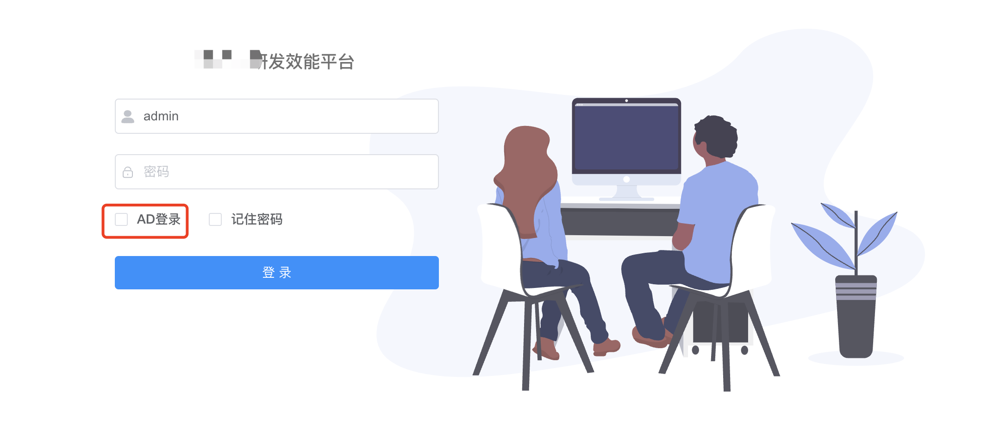

## 前置条件

1. 安装好 gitlab
2. 安装好 gitlab 对应版本到 runner（k8s 部署方式）
3. 准备好 ldap 服务（服务体验可以先忽略，用默认到账号登录）
4. k8s 集群

## 服务说明
> helm 当前有默认以下服务，后续会尽量将相关服务都整合进来

| 服务               | 说明                                        |
| :--------------- |:------------------------------------------|
| hotwheel-backend | 后端核心服务                                    |
| hotwheel-ui      | 前端页面                                      |
| hotwheel-agent   | k8s 交互部分接口【开发中，还未集成到 helm】	               |
| mysql            | 数据库，内置相关业务数据，如果要用外部服务可以解压相关 helm 获取相关 sql |
| redis            | 缓存服务                                      |

## 部署参数说明

| 配置	                           | 默认值	                                                                                                                                                         | 说明                              |
|-------------------------------|--------------------------------------------------------------------------------------------------------------------------------------------------------------|---------------------------------|
| ingress.backend.hosts\[0].host | api.example.cn                                                                                                                                               | 后端服务地址，供前端浏览器调用                 |
| ingress.ui.hosts\[0].host     | hotwheel.example.cn                                                                                                                                          | 前端地址                            |
| mysql.enabled	              | true	                                                                                                                                                        | 使用 helm 包里面的 mysql，内置数据         |
| mysql.insertInitData          | true                                                                                                                                                         | *初始化风火轮平台的数据，第一次必需要，后续更新不用。*    |
| mysql.persistence             | false                                                                                                                                                        | 为了快速体验，默认不持久化，正式环境要配置上                                |
| redis.enabled                 | true                                                                                                                                                         | 使用 helm 包里面的 redis 服务           |
| redis.persistence             | false                                                                                                                                                        |  为了快速体验，默认不持久化，正式环境要配置上                               |
| config.database\_url          | jdbc\:mysql://mysql/hotwheel?useUnicode=true \&characterEncoding=utf8 \&zeroDateTimeBehavior=convertToNull \&useSSL=true\&serverTimezone=GMT%2B8 | 默认连的是 helm 包里面的 mysql 服务 svc 地址 |
| config.database\_username     | root                                                                                                                                                         |                                 |
| config.database\_password     | kubeclub                                                                                                                                                     | 数据库 root 密码                     |
| config.app\_backend\_url      | <http://backend.xxx.com>                                                                                                                                     | 后端服务地址                          |
| config.app\_ui\_url           | <http://www.xxx.com>                                                                                                                                         | 前端服务地址                          |
| config.redis.host             | redis                                                                                                                                                        | 默认连的是 helm 包里面的 redis 服务 svc 地址 |
| config.redis.port             | 6379                                                                                                                                                         |                                 |
| config.redis.password         | kubeclub                                                                                                                                                     | redis 密码                        |
| config.ldap.urls              | ldap\://xxx:389                                                                                                                                              | ldap 服务，用于平台认证服务                |
| config.ldap.username          | xxx                                                                                                                                                          |                                 |
| config.ldap.password          | xxx                                                                                                                                                          |                                 |
| config.ldap.base              | dc=kubeclub,dc=com                                                                                                                                           |                                 |
| config.gitlab.url             | http://git.xxx.com/                                                                                                                                          | gitlab 地址                       |
| config.gitlab.token           | xxx                                                                                                                                                          | gitlab token 值                  |
| config.gitlab.userId          | 1                                                                                                                                                            | gitlab token 对应到用户ID            |

**注意**
_为了快速体验，mysql、redis 默认都没有持久化_

## 访问

- **账号**：(非 ldap 登录页面要把 ldap 勾选框去除)
    - admin
    - 123admin

## 依赖服务配置
1. [注册 gitlab runner 并配置到风火轮平台](gitlab-runner.md) 【必需】
2. [搭建 sonarqube 静态代码扫描服务，并配置到风火轮平台](sonarqube.md) 【可选】
3. [监控](grafana.md) 【可选】

## 常见问题

[前往问答社区](https://www.kubeclub.cn/ask7/questions.html)

* 系统中用到 flowable 工作流，数据库要关闭大小写敏感