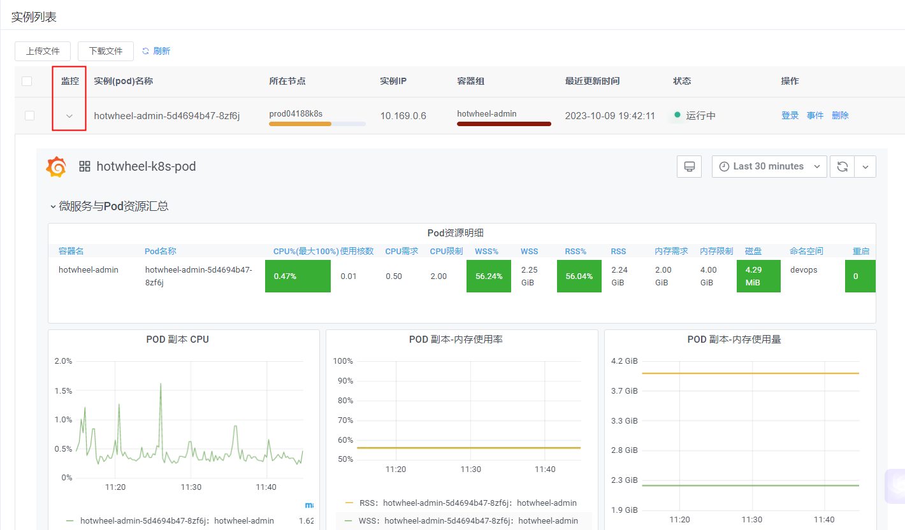

## 监控
> grafana 内嵌仪表盘



## iframe 传递参数
- var-NameSpace=
- var-Container=All
- var-Pod=

## grafana JSON Model

```
{
  "annotations": {
    "list": [
      {
        "builtIn": 1,
        "datasource": "-- Grafana --",
        "enable": true,
        "hide": true,
        "iconColor": "rgba(0, 211, 255, 1)",
        "name": "Annotations & Alerts",
        "type": "dashboard"
      }
    ]
  },
  "description": "效能平台内嵌仪表盘",
  "editable": true,
  "gnetId": 13105,
  "graphTooltip": 0,
  "id": 8,
  "iteration": 1697427517472,
  "links": [
    {
      "icon": "bolt",
      "tags": [],
      "targetBlank": true,
      "title": "Update",
      "tooltip": "更新当前仪表板",
      "type": "link",
      "url": "https://grafana.com/dashboards/13105"
    },
    {
      "icon": "question",
      "tags": [
        "node_exporter"
      ],
      "targetBlank": true,
      "title": "GitHub",
      "tooltip": "查看更多仪表板",
      "type": "link",
      "url": "https://github.com/starsliao/Prometheus"
    },
    {
      "asDropdown": true,
      "icon": "external link",
      "tags": [],
      "targetBlank": true,
      "type": "dashboards"
    }
  ],
  "panels": [
    {
      "collapsed": false,
      "datasource": "Prometheus",
      "gridPos": {
        "h": 1,
        "w": 24,
        "x": 0,
        "y": 0
      },
      "id": 61,
      "panels": [],
      "title": "微服务与Pod资源汇总",
      "type": "row"
    },
    {
      "columns": [],
      "datasource": "Prometheus",
      "fieldConfig": {
        "defaults": {
          "custom": {}
        },
        "overrides": []
      },
      "fontSize": "80%",
      "gridPos": {
        "h": 4,
        "w": 24,
        "x": 0,
        "y": 1
      },
      "id": 47,
      "pageSize": null,
      "showHeader": true,
      "sort": {
        "col": null,
        "desc": false
      },
      "styles": [
        {
          "alias": "Time",
          "align": "auto",
          "dateFormat": "YYYY-MM-DD HH:mm:ss",
          "pattern": "Time",
          "type": "hidden"
        },
        {
          "alias": "容器名",
          "align": "auto",
          "colorMode": null,
          "colors": [
            "rgba(245, 54, 54, 0.9)",
            "rgba(237, 129, 40, 0.89)",
            "rgba(50, 172, 45, 0.97)"
          ],
          "dateFormat": "YYYY-MM-DD HH:mm:ss",
          "decimals": 2,
          "mappingType": 1,
          "pattern": "container",
          "thresholds": [],
          "type": "string",
          "unit": "short"
        },
        {
          "alias": "Pod名称",
          "align": "auto",
          "colorMode": null,
          "colors": [
            "rgba(245, 54, 54, 0.9)",
            "rgba(237, 129, 40, 0.89)",
            "rgba(50, 172, 45, 0.97)"
          ],
          "dateFormat": "YYYY-MM-DD HH:mm:ss",
          "decimals": 2,
          "mappingType": 1,
          "pattern": "pod",
          "thresholds": [],
          "type": "number",
          "unit": "short"
        },
        {
          "alias": "CPU%(最大100%)",
          "align": "auto",
          "colorMode": "cell",
          "colors": [
            "rgba(50, 172, 45, 0.97)",
            "rgba(237, 129, 40, 0.89)",
            "rgba(245, 54, 54, 0.9)"
          ],
          "dateFormat": "YYYY-MM-DD HH:mm:ss",
          "decimals": 2,
          "mappingType": 1,
          "pattern": "Value #A",
          "thresholds": [
            "50",
            "70"
          ],
          "type": "number",
          "unit": "percent"
        },
        {
          "alias": "CPU需求",
          "align": "auto",
          "colorMode": null,
          "colors": [
            "rgba(245, 54, 54, 0.9)",
            "rgba(237, 129, 40, 0.89)",
            "rgba(50, 172, 45, 0.97)"
          ],
          "dateFormat": "YYYY-MM-DD HH:mm:ss",
          "decimals": 2,
          "mappingType": 1,
          "pattern": "Value #B",
          "thresholds": [],
          "type": "number",
          "unit": "short"
        },
        {
          "alias": "CPU限制",
          "align": "auto",
          "colorMode": null,
          "colors": [
            "rgba(245, 54, 54, 0.9)",
            "rgba(237, 129, 40, 0.89)",
            "rgba(50, 172, 45, 0.97)"
          ],
          "dateFormat": "YYYY-MM-DD HH:mm:ss",
          "decimals": 2,
          "mappingType": 1,
          "pattern": "Value #C",
          "thresholds": [],
          "type": "number",
          "unit": "short"
        },
        {
          "alias": "WSS",
          "align": "auto",
          "colorMode": null,
          "colors": [
            "rgba(245, 54, 54, 0.9)",
            "rgba(237, 129, 40, 0.89)",
            "rgba(50, 172, 45, 0.97)"
          ],
          "dateFormat": "YYYY-MM-DD HH:mm:ss",
          "decimals": 2,
          "mappingType": 1,
          "pattern": "Value #D",
          "thresholds": [],
          "type": "number",
          "unit": "bytes"
        },
        {
          "alias": "内存需求",
          "align": "auto",
          "colorMode": null,
          "colors": [
            "rgba(245, 54, 54, 0.9)",
            "rgba(237, 129, 40, 0.89)",
            "rgba(50, 172, 45, 0.97)"
          ],
          "dateFormat": "YYYY-MM-DD HH:mm:ss",
          "decimals": 2,
          "mappingType": 1,
          "pattern": "Value #E",
          "thresholds": [],
          "type": "number",
          "unit": "bytes"
        },
        {
          "alias": "内存限制",
          "align": "auto",
          "colorMode": null,
          "colors": [
            "rgba(245, 54, 54, 0.9)",
            "rgba(237, 129, 40, 0.89)",
            "rgba(50, 172, 45, 0.97)"
          ],
          "dateFormat": "YYYY-MM-DD HH:mm:ss",
          "decimals": 2,
          "mappingType": 1,
          "pattern": "Value #F",
          "thresholds": [],
          "type": "number",
          "unit": "bytes"
        },
        {
          "alias": "命名空间",
          "align": "auto",
          "colorMode": null,
          "colors": [
            "rgba(245, 54, 54, 0.9)",
            "rgba(237, 129, 40, 0.89)",
            "rgba(50, 172, 45, 0.97)"
          ],
          "dateFormat": "YYYY-MM-DD HH:mm:ss",
          "decimals": 2,
          "mappingType": 1,
          "pattern": "namespace",
          "thresholds": [],
          "type": "string",
          "unit": "short"
        },
        {
          "alias": "状态",
          "align": "auto",
          "colorMode": null,
          "colors": [
            "rgba(245, 54, 54, 0.9)",
            "rgba(237, 129, 40, 0.89)",
            "rgba(50, 172, 45, 0.97)"
          ],
          "dateFormat": "YYYY-MM-DD HH:mm:ss",
          "decimals": 2,
          "mappingType": 1,
          "pattern": "phase",
          "thresholds": [],
          "type": "hidden",
          "unit": "short",
          "valueMaps": []
        },
        {
          "alias": "重启",
          "align": "auto",
          "colorMode": "cell",
          "colors": [
            "rgba(50, 172, 45, 0.97)",
            "rgba(237, 129, 40, 0.89)",
            "rgba(245, 54, 54, 0.9)"
          ],
          "dateFormat": "YYYY-MM-DD HH:mm:ss",
          "decimals": 2,
          "mappingType": 1,
          "pattern": "Value #H",
          "thresholds": [
            "1",
            "5"
          ],
          "type": "string",
          "unit": "short"
        },
        {
          "alias": "WSS%",
          "align": "",
          "colorMode": "cell",
          "colors": [
            "rgba(50, 172, 45, 0.97)",
            "rgba(237, 129, 40, 0.89)",
            "rgba(245, 54, 54, 0.9)"
          ],
          "dateFormat": "YYYY-MM-DD HH:mm:ss",
          "decimals": 2,
          "mappingType": 1,
          "pattern": "Value #I",
          "thresholds": [
            "80",
            "90"
          ],
          "type": "number",
          "unit": "percent"
        },
        {
          "alias": "磁盘",
          "align": "auto",
          "colorMode": "cell",
          "colors": [
            "rgba(50, 172, 45, 0.97)",
            "rgba(237, 129, 40, 0.89)",
            "rgba(245, 54, 54, 0.9)"
          ],
          "dateFormat": "YYYY-MM-DD HH:mm:ss",
          "decimals": 2,
          "mappingType": 1,
          "pattern": "Value #J",
          "thresholds": [
            "10737418240",
            "16106127360"
          ],
          "type": "number",
          "unit": "bytes"
        },
        {
          "alias": "RSS",
          "align": "auto",
          "colorMode": null,
          "colors": [
            "rgba(245, 54, 54, 0.9)",
            "rgba(237, 129, 40, 0.89)",
            "rgba(50, 172, 45, 0.97)"
          ],
          "dateFormat": "YYYY-MM-DD HH:mm:ss",
          "decimals": 2,
          "mappingType": 1,
          "pattern": "Value #K",
          "thresholds": [],
          "type": "number",
          "unit": "bytes"
        },
        {
          "alias": "RSS%",
          "align": "auto",
          "colorMode": "cell",
          "colors": [
            "rgba(50, 172, 45, 0.97)",
            "rgba(237, 129, 40, 0.89)",
            "rgba(245, 54, 54, 0.9)"
          ],
          "dateFormat": "YYYY-MM-DD HH:mm:ss",
          "decimals": 2,
          "mappingType": 1,
          "pattern": "Value #L",
          "thresholds": [
            "80",
            "90"
          ],
          "type": "number",
          "unit": "percent"
        },
        {
          "alias": "heap",
          "align": "auto",
          "colorMode": null,
          "colors": [
            "rgba(245, 54, 54, 0.9)",
            "rgba(237, 129, 40, 0.89)",
            "rgba(50, 172, 45, 0.97)"
          ],
          "dateFormat": "YYYY-MM-DD HH:mm:ss",
          "decimals": 2,
          "mappingType": 1,
          "pattern": "Value #M",
          "thresholds": [],
          "type": "number",
          "unit": "bytes"
        },
        {
          "alias": "heap_max",
          "align": "auto",
          "colorMode": null,
          "colors": [
            "rgba(245, 54, 54, 0.9)",
            "rgba(237, 129, 40, 0.89)",
            "rgba(50, 172, 45, 0.97)"
          ],
          "dateFormat": "YYYY-MM-DD HH:mm:ss",
          "decimals": 2,
          "mappingType": 1,
          "pattern": "Value #N",
          "thresholds": [],
          "type": "number",
          "unit": "bytes"
        },
        {
          "alias": "noheap",
          "align": "auto",
          "colorMode": null,
          "colors": [
            "rgba(245, 54, 54, 0.9)",
            "rgba(237, 129, 40, 0.89)",
            "rgba(50, 172, 45, 0.97)"
          ],
          "dateFormat": "YYYY-MM-DD HH:mm:ss",
          "decimals": 2,
          "mappingType": 1,
          "pattern": "Value #O",
          "thresholds": [],
          "type": "number",
          "unit": "bytes"
        },
        {
          "alias": "noheap_max",
          "align": "auto",
          "colorMode": null,
          "colors": [
            "rgba(245, 54, 54, 0.9)",
            "rgba(237, 129, 40, 0.89)",
            "rgba(50, 172, 45, 0.97)"
          ],
          "dateFormat": "YYYY-MM-DD HH:mm:ss",
          "decimals": 2,
          "mappingType": 1,
          "pattern": "Value #P",
          "thresholds": [],
          "type": "number",
          "unit": "bytes"
        },
        {
          "alias": "使用核数",
          "align": "auto",
          "colorMode": null,
          "colors": [
            "rgba(245, 54, 54, 0.9)",
            "rgba(237, 129, 40, 0.89)",
            "rgba(50, 172, 45, 0.97)"
          ],
          "dateFormat": "YYYY-MM-DD HH:mm:ss",
          "decimals": 2,
          "mappingType": 1,
          "pattern": "Value #Q",
          "thresholds": [],
          "type": "number",
          "unit": "short"
        },
        {
          "alias": "",
          "align": "right",
          "colorMode": null,
          "colors": [
            "rgba(245, 54, 54, 0.9)",
            "rgba(237, 129, 40, 0.89)",
            "rgba(50, 172, 45, 0.97)"
          ],
          "decimals": 2,
          "pattern": "/.*/",
          "thresholds": [],
          "type": "hidden",
          "unit": "short"
        }
      ],
      "targets": [
        {
          "expr": "kube_pod_status_phase{pod=~\"$Pod\",container =~\"$Container\",namespace=~\"$NameSpace\"} == 1",
          "format": "table",
          "hide": false,
          "instant": true,
          "interval": "",
          "legendFormat": "",
          "refId": "G"
        },
        {
          "expr": "sum(irate(container_cpu_usage_seconds_total{pod=~\"$Pod\",container =~\"$Container\",container !=\"\",container!=\"POD\",namespace=~\"$NameSpace\"}[2m])) by (container, pod) / (sum(container_spec_cpu_quota{pod=~\"$Pod\",container =~\"$Container\",container !=\"\",container!=\"POD\",namespace=~\"$NameSpace\"}/100000) by (container, pod)) * 100",
          "format": "table",
          "hide": false,
          "instant": true,
          "interval": "",
          "legendFormat": "",
          "refId": "A"
        },
        {
          "expr": "sum(irate(container_cpu_usage_seconds_total{pod=~\"$Pod\",container =~\"$Container\",container !=\"\",container!=\"POD\",namespace=~\"$NameSpace\"}[2m])) by (container, pod)",
          "format": "table",
          "hide": false,
          "instant": true,
          "interval": "",
          "legendFormat": "CPU核数使用",
          "refId": "Q"
        },
        {
          "expr": "sum(kube_pod_container_resource_requests_cpu_cores{pod=~\"$Pod\",container =~\"$Container\",namespace=~\"$NameSpace\"}) by (container,pod)",
          "format": "table",
          "hide": false,
          "instant": true,
          "interval": "",
          "legendFormat": "",
          "refId": "B"
        },
        {
          "expr": "sum(kube_pod_container_resource_limits_cpu_cores{pod=~\"$Pod\",container =~\"$Container\",namespace=~\"$NameSpace\"}) by (container,pod)",
          "format": "table",
          "instant": true,
          "interval": "",
          "legendFormat": "",
          "refId": "C"
        },
        {
          "expr": "sum (container_memory_working_set_bytes{pod=~\"$Pod\",container =~\"$Container\",container !=\"\",container!=\"POD\",namespace=~\"$NameSpace\"}) by (container, pod)/ sum(container_spec_memory_limit_bytes{pod=~\"$Pod\",container =~\"$Container\",container !=\"\",container!=\"POD\",namespace=~\"$NameSpace\"}) by (container, pod) * 100",
          "format": "table",
          "hide": false,
          "instant": true,
          "interval": "",
          "legendFormat": "wss%",
          "refId": "I"
        },
        {
          "expr": "sum (container_memory_working_set_bytes{pod=~\"$Pod\",container =~\"$Container\",container !=\"\",container!=\"POD\",namespace=~\"$NameSpace\"}) by (container, pod)",
          "format": "table",
          "hide": false,
          "instant": true,
          "interval": "",
          "legendFormat": "wss",
          "refId": "D"
        },
        {
          "expr": "sum (container_memory_rss{pod=~\"$Pod\",container =~\"$Container\",container !=\"\",container!=\"POD\",namespace=~\"$NameSpace\"}) by (container, pod)/ sum(container_spec_memory_limit_bytes{pod=~\"$Pod\",container =~\"$Container\",container !=\"\",container!=\"POD\",namespace=~\"$NameSpace\"}) by (container, pod) * 100",
          "format": "table",
          "hide": false,
          "instant": true,
          "interval": "",
          "legendFormat": "rss%",
          "refId": "L"
        },
        {
          "expr": "sum (container_memory_rss{pod=~\"$Pod\",container =~\"$Container\",container !=\"\",container!=\"POD\",namespace=~\"$NameSpace\"}) by (container, pod)",
          "format": "table",
          "hide": false,
          "instant": true,
          "interval": "",
          "legendFormat": "rss",
          "refId": "K"
        },
        {
          "expr": "sum(kube_pod_container_resource_requests_memory_bytes{pod=~\"$Pod\",container =~\"$Container\",namespace=~\"$NameSpace\"}) by (container,pod)",
          "format": "table",
          "hide": false,
          "instant": true,
          "interval": "",
          "legendFormat": "",
          "refId": "E"
        },
        {
          "expr": "sum(kube_pod_container_resource_limits_memory_bytes{pod=~\"$Pod\",container =~\"$Container\",namespace=~\"$NameSpace\"}) by (container,pod)",
          "format": "table",
          "hide": false,
          "instant": true,
          "interval": "",
          "legendFormat": "",
          "refId": "F"
        },
        {
          "expr": "sum(container_fs_usage_bytes{pod=~\"$Pod\",container =~\"$Container\",container !=\"\",container!=\"POD\",namespace=~\"$NameSpace\"}) by (container,pod)",
          "format": "table",
          "instant": true,
          "interval": "",
          "legendFormat": "",
          "refId": "J"
        },
        {
          "expr": "kube_pod_container_status_restarts_total{pod=~\"$Pod\",container =~\"$Container\",namespace=~\"$NameSpace\"} - 0",
          "format": "table",
          "instant": true,
          "interval": "",
          "legendFormat": "",
          "refId": "H"
        },
        {
          "expr": "cass_jvm_heap{service=~\"$Container\"} * on (pod_ip) group_right(service) kube_pod_info{pod=~\"$Pod\",namespace=~\"$NameSpace\"}",
          "format": "table",
          "hide": false,
          "instant": true,
          "interval": "",
          "legendFormat": "",
          "refId": "M"
        },
        {
          "expr": "cass_jvm_heap_max{service=~\"$Container\"} * on (pod_ip) group_right(service) kube_pod_info{pod=~\"$Pod\",namespace=~\"$NameSpace\"}",
          "format": "table",
          "hide": false,
          "instant": true,
          "interval": "",
          "legendFormat": "",
          "refId": "N"
        },
        {
          "expr": "cass_jvm_noheap{service=~\"$Container\"} * on (pod_ip) group_right(service) kube_pod_info{pod=~\"$Pod\",namespace=~\"$NameSpace\"}",
          "format": "table",
          "hide": false,
          "instant": true,
          "interval": "",
          "legendFormat": "",
          "refId": "O"
        },
        {
          "expr": "cass_jvm_noheap_max{service=~\"$Container\"} * on (pod_ip) group_right(service) kube_pod_info{pod=~\"$Pod\",namespace=~\"$NameSpace\"}",
          "format": "table",
          "hide": false,
          "instant": true,
          "interval": "",
          "legendFormat": "",
          "refId": "P"
        }
      ],
      "timeFrom": null,
      "timeShift": null,
      "title": "Pod资源明细",
      "transform": "table",
      "type": "table-old"
    },
    {
      "aliasColors": {},
      "bars": false,
      "dashLength": 10,
      "dashes": false,
      "datasource": "Prometheus",
      "decimals": 2,
      "editable": true,
      "error": false,
      "fieldConfig": {
        "defaults": {
          "custom": {}
        },
        "overrides": []
      },
      "fill": 0,
      "fillGradient": 0,
      "grid": {},
      "gridPos": {
        "h": 8,
        "w": 8,
        "x": 0,
        "y": 5
      },
      "height": "",
      "hiddenSeries": false,
      "id": 58,
      "isNew": true,
      "legend": {
        "alignAsTable": true,
        "avg": false,
        "current": true,
        "hideEmpty": false,
        "hideZero": false,
        "max": true,
        "min": false,
        "rightSide": false,
        "show": true,
        "sideWidth": null,
        "sort": "current",
        "sortDesc": true,
        "total": false,
        "values": true
      },
      "lines": true,
      "linewidth": 1,
      "links": [],
      "nullPointMode": "null",
      "options": {
        "alertThreshold": true
      },
      "percentage": false,
      "pluginVersion": "7.2.2",
      "pointradius": 5,
      "points": false,
      "renderer": "flot",
      "seriesOverrides": [],
      "spaceLength": 10,
      "stack": false,
      "steppedLine": false,
      "targets": [
        {
          "expr": "sum(irate(container_cpu_usage_seconds_total{pod=~\"$Pod\",container =~\"$Container\",container !=\"\",container!=\"POD\",node=~\"$Node\",namespace=~\"$NameSpace\"}[2m])) by (container, pod) / (sum(container_spec_cpu_quota{pod=~\"$Pod\",container =~\"$Container\",container !=\"\",container!=\"POD\",node=~\"$Node\",namespace=~\"$NameSpace\"}/100000) by (container, pod)) * 100",
          "hide": false,
          "instant": false,
          "interval": "",
          "intervalFactor": 1,
          "legendFormat": "{{ pod }}：{{container}}",
          "metric": "container_cpu",
          "refId": "A",
          "step": 10
        }
      ],
      "thresholds": [],
      "timeFrom": null,
      "timeRegions": [],
      "timeShift": null,
      "title": "POD 副本 CPU",
      "tooltip": {
        "msResolution": true,
        "shared": true,
        "sort": 2,
        "value_type": "cumulative"
      },
      "type": "graph",
      "xaxis": {
        "buckets": null,
        "mode": "time",
        "name": null,
        "show": true,
        "values": []
      },
      "yaxes": [
        {
          "format": "percent",
          "label": "",
          "logBase": 1,
          "max": null,
          "min": null,
          "show": true
        },
        {
          "format": "short",
          "label": null,
          "logBase": 1,
          "max": null,
          "min": null,
          "show": false
        }
      ],
      "yaxis": {
        "align": false,
        "alignLevel": null
      }
    },
    {
      "aliasColors": {},
      "bars": false,
      "dashLength": 10,
      "dashes": false,
      "datasource": "Prometheus",
      "decimals": 2,
      "editable": true,
      "error": false,
      "fieldConfig": {
        "defaults": {
          "custom": {}
        },
        "overrides": []
      },
      "fill": 0,
      "fillGradient": 0,
      "grid": {},
      "gridPos": {
        "h": 8,
        "w": 8,
        "x": 8,
        "y": 5
      },
      "hiddenSeries": false,
      "id": 27,
      "isNew": true,
      "legend": {
        "alignAsTable": true,
        "avg": false,
        "current": true,
        "max": true,
        "min": false,
        "rightSide": false,
        "show": true,
        "sideWidth": null,
        "sort": "current",
        "sortDesc": false,
        "total": false,
        "values": true
      },
      "lines": true,
      "linewidth": 2,
      "links": [],
      "nullPointMode": "null",
      "options": {
        "alertThreshold": true
      },
      "percentage": false,
      "pluginVersion": "7.2.2",
      "pointradius": 5,
      "points": false,
      "renderer": "flot",
      "seriesOverrides": [],
      "spaceLength": 10,
      "stack": false,
      "steppedLine": false,
      "targets": [
        {
          "expr": "sum (container_memory_working_set_bytes{pod=~\"$Pod\",container =~\"$Container\",container !=\"\",container!=\"POD\",node=~\"$Node\",namespace=~\"$NameSpace\"}) by (container, pod)/ sum(container_spec_memory_limit_bytes{pod=~\"$Pod\",container =~\"$Container\",container !=\"\",container!=\"POD\",node=~\"$Node\",namespace=~\"$NameSpace\"}) by (container, pod) * 100",
          "interval": "",
          "intervalFactor": 1,
          "legendFormat": "WSS：{{ pod }}：{{container}}",
          "metric": "container_memory_usage:sort_desc",
          "refId": "A",
          "step": 10
        },
        {
          "expr": "sum (container_memory_rss{pod=~\"$Pod\",container =~\"$Container\",container !=\"\",container!=\"POD\",node=~\"$Node\",namespace=~\"$NameSpace\"}) by (container, pod)/ sum(container_spec_memory_limit_bytes{pod=~\"$Pod\",container =~\"$Container\",container !=\"\",container!=\"POD\",node=~\"$Node\",namespace=~\"$NameSpace\"}) by (container, pod) * 100",
          "interval": "",
          "intervalFactor": 1,
          "legendFormat": "RSS：{{ pod }}：{{container}}",
          "metric": "container_memory_usage:sort_desc",
          "refId": "B",
          "step": 10
        },
        {
          "expr": "(cass_jvm_heap{service=~\"$Container\"} * on (pod_ip) group_right(service) kube_pod_info{pod=~\"$Pod\",namespace=~\"$NameSpace\"}) / (cass_jvm_heap_max{service=~\"$Container\"} * on (pod_ip) group_right(service) kube_pod_info{pod=~\"$Pod\",namespace=~\"$NameSpace\"}) * 100",
          "instant": false,
          "interval": "",
          "intervalFactor": 1,
          "legendFormat": "Heap：{{ pod }}：{{container}}",
          "metric": "container_memory_usage:sort_desc",
          "refId": "C",
          "step": 10
        }
      ],
      "thresholds": [],
      "timeFrom": null,
      "timeRegions": [],
      "timeShift": null,
      "title": "POD 副本-内存使用率",
      "tooltip": {
        "msResolution": false,
        "shared": true,
        "sort": 2,
        "value_type": "cumulative"
      },
      "type": "graph",
      "xaxis": {
        "buckets": null,
        "mode": "time",
        "name": null,
        "show": true,
        "values": []
      },
      "yaxes": [
        {
          "format": "percent",
          "label": null,
          "logBase": 1,
          "max": "100",
          "min": null,
          "show": true
        },
        {
          "format": "short",
          "label": null,
          "logBase": 1,
          "max": null,
          "min": null,
          "show": false
        }
      ],
      "yaxis": {
        "align": false,
        "alignLevel": null
      }
    },
    {
      "aliasColors": {},
      "bars": false,
      "dashLength": 10,
      "dashes": false,
      "datasource": "Prometheus",
      "decimals": 2,
      "editable": true,
      "error": false,
      "fieldConfig": {
        "defaults": {
          "custom": {}
        },
        "overrides": []
      },
      "fill": 0,
      "fillGradient": 0,
      "grid": {},
      "gridPos": {
        "h": 8,
        "w": 8,
        "x": 16,
        "y": 5
      },
      "hiddenSeries": false,
      "id": 62,
      "isNew": true,
      "legend": {
        "alignAsTable": true,
        "avg": false,
        "current": true,
        "max": true,
        "min": false,
        "rightSide": false,
        "show": false,
        "sideWidth": null,
        "sort": "current",
        "sortDesc": true,
        "total": false,
        "values": true
      },
      "lines": true,
      "linewidth": 2,
      "links": [],
      "nullPointMode": "null",
      "options": {
        "alertThreshold": true
      },
      "percentage": false,
      "pluginVersion": "7.2.2",
      "pointradius": 5,
      "points": false,
      "renderer": "flot",
      "seriesOverrides": [
        {
          "alias": "/limits：.*/",
          "color": "#C4162A"
        }
      ],
      "spaceLength": 10,
      "stack": false,
      "steppedLine": false,
      "targets": [
        {
          "expr": "sum (container_memory_working_set_bytes{pod=~\"$Pod\",container =~\"$Container\",container !=\"\",container!=\"POD\",node=~\"$Node\",namespace=~\"$NameSpace\"}) by (container, pod)",
          "interval": "",
          "intervalFactor": 1,
          "legendFormat": "WSS 内存：{{ pod }}：{{container}}",
          "metric": "container_memory_usage:sort_desc",
          "refId": "A",
          "step": 10
        },
        {
          "expr": "sum(kube_pod_container_resource_limits_memory_bytes{pod=~\"$Pod\",container =~\"$Container\",namespace=~\"$NameSpace\"}) by (container,pod)",
          "interval": "",
          "intervalFactor": 1,
          "legendFormat": "limits 内存：{{ pod }}：{{container}}",
          "metric": "container_memory_usage:sort_desc",
          "refId": "C",
          "step": 10
        },
        {
          "expr": "cass_jvm_heap{service=~\"$Container\"} * on (pod_ip) group_right(service) kube_pod_info{pod=~\"$Pod\",namespace=~\"$NameSpace\"}",
          "interval": "",
          "intervalFactor": 1,
          "legendFormat": "Heap：{{ pod }}：{{container}}",
          "metric": "container_memory_usage:sort_desc",
          "refId": "D",
          "step": 10
        }
      ],
      "thresholds": [],
      "timeFrom": null,
      "timeRegions": [],
      "timeShift": null,
      "title": "POD 副本-内存使用量",
      "tooltip": {
        "msResolution": false,
        "shared": true,
        "sort": 2,
        "value_type": "cumulative"
      },
      "type": "graph",
      "xaxis": {
        "buckets": null,
        "mode": "time",
        "name": null,
        "show": true,
        "values": []
      },
      "yaxes": [
        {
          "format": "bytes",
          "label": null,
          "logBase": 1,
          "max": null,
          "min": null,
          "show": true
        },
        {
          "format": "short",
          "label": null,
          "logBase": 1,
          "max": null,
          "min": null,
          "show": false
        }
      ],
      "yaxis": {
        "align": false,
        "alignLevel": null
      }
    },
    {
      "aliasColors": {},
      "bars": false,
      "dashLength": 10,
      "dashes": false,
      "datasource": "Prometheus",
      "decimals": 3,
      "editable": true,
      "error": false,
      "fieldConfig": {
        "defaults": {
          "custom": {}
        },
        "overrides": []
      },
      "fill": 0,
      "fillGradient": 0,
      "grid": {},
      "gridPos": {
        "h": 7,
        "w": 8,
        "x": 0,
        "y": 13
      },
      "height": "",
      "hiddenSeries": false,
      "id": 24,
      "isNew": true,
      "legend": {
        "alignAsTable": true,
        "avg": true,
        "current": true,
        "hideEmpty": false,
        "hideZero": false,
        "max": true,
        "min": true,
        "rightSide": false,
        "show": true,
        "sideWidth": null,
        "sort": "current",
        "sortDesc": true,
        "total": false,
        "values": true
      },
      "lines": true,
      "linewidth": 1,
      "links": [],
      "nullPointMode": "null",
      "options": {
        "alertThreshold": true
      },
      "percentage": false,
      "pluginVersion": "7.2.2",
      "pointradius": 5,
      "points": false,
      "renderer": "flot",
      "seriesOverrides": [],
      "spaceLength": 10,
      "stack": false,
      "steppedLine": false,
      "targets": [
        {
          "expr": "sum(rate(container_cpu_usage_seconds_total{pod=~\"$Pod\",container =~\"$Container\",container !=\"\",container!=\"POD\",namespace=~\"$NameSpace\"}[2m])) by (container) / (sum(container_spec_cpu_quota{pod=~\"$Pod\",container =~\"$Container\",container !=\"\",container!=\"POD\",namespace=~\"$NameSpace\"}/100000) by (container)) * 100",
          "hide": false,
          "instant": false,
          "interval": "",
          "intervalFactor": 1,
          "legendFormat": "{{ container}}",
          "metric": "container_cpu",
          "refId": "A",
          "step": 10
        }
      ],
      "thresholds": [],
      "timeFrom": null,
      "timeRegions": [],
      "timeShift": null,
      "title": "服务-整体-CPU使用率(最大100%)",
      "tooltip": {
        "msResolution": true,
        "shared": true,
        "sort": 2,
        "value_type": "cumulative"
      },
      "type": "graph",
      "xaxis": {
        "buckets": null,
        "mode": "time",
        "name": null,
        "show": true,
        "values": []
      },
      "yaxes": [
        {
          "format": "percent",
          "label": "",
          "logBase": 1,
          "max": null,
          "min": null,
          "show": true
        },
        {
          "format": "short",
          "label": null,
          "logBase": 1,
          "max": null,
          "min": null,
          "show": false
        }
      ],
      "yaxis": {
        "align": false,
        "alignLevel": null
      }
    },
    {
      "aliasColors": {},
      "bars": false,
      "dashLength": 10,
      "dashes": false,
      "datasource": "Prometheus",
      "decimals": 2,
      "editable": true,
      "error": false,
      "fieldConfig": {
        "defaults": {
          "custom": {}
        },
        "overrides": []
      },
      "fill": 0,
      "fillGradient": 0,
      "grid": {},
      "gridPos": {
        "h": 7,
        "w": 8,
        "x": 8,
        "y": 13
      },
      "hiddenSeries": false,
      "id": 59,
      "isNew": true,
      "legend": {
        "alignAsTable": true,
        "avg": true,
        "current": true,
        "max": true,
        "min": true,
        "rightSide": false,
        "show": true,
        "sideWidth": null,
        "sort": "current",
        "sortDesc": true,
        "total": false,
        "values": true
      },
      "lines": true,
      "linewidth": 2,
      "links": [],
      "nullPointMode": "null",
      "options": {
        "alertThreshold": true
      },
      "percentage": false,
      "pluginVersion": "7.2.2",
      "pointradius": 5,
      "points": false,
      "renderer": "flot",
      "seriesOverrides": [],
      "spaceLength": 10,
      "stack": false,
      "steppedLine": false,
      "targets": [
        {
          "expr": "sum (container_memory_working_set_bytes{pod=~\"$Pod\",container =~\"$Container\",container !=\"\",container!=\"POD\",namespace=~\"$NameSpace\"}) by (container)/ sum(container_spec_memory_limit_bytes{pod=~\"$Pod\",container =~\"$Container\",container !=\"\",container!=\"POD\",namespace=~\"$NameSpace\"}) by (container) * 100",
          "interval": "",
          "intervalFactor": 1,
          "legendFormat": "WSS：{{ container }}",
          "metric": "container_memory_usage:sort_desc",
          "refId": "A",
          "step": 10
        },
        {
          "expr": "sum (container_memory_rss{pod=~\"$Pod\",container =~\"$Container\",container !=\"\",container!=\"POD\",namespace=~\"$NameSpace\"}) by (container)/ sum(container_spec_memory_limit_bytes{pod=~\"$Pod\",container =~\"$Container\",container !=\"\",container!=\"POD\",namespace=~\"$NameSpace\"}) by (container) * 100",
          "interval": "",
          "intervalFactor": 1,
          "legendFormat": "RSS：{{ container }}",
          "metric": "container_memory_usage:sort_desc",
          "refId": "B",
          "step": 10
        }
      ],
      "thresholds": [],
      "timeFrom": null,
      "timeRegions": [],
      "timeShift": null,
      "title": "服务-整体-内存使用率",
      "tooltip": {
        "msResolution": false,
        "shared": true,
        "sort": 2,
        "value_type": "cumulative"
      },
      "type": "graph",
      "xaxis": {
        "buckets": null,
        "mode": "time",
        "name": null,
        "show": true,
        "values": []
      },
      "yaxes": [
        {
          "format": "percent",
          "label": null,
          "logBase": 1,
          "max": null,
          "min": null,
          "show": true
        },
        {
          "format": "short",
          "label": null,
          "logBase": 1,
          "max": null,
          "min": null,
          "show": false
        }
      ],
      "yaxis": {
        "align": false,
        "alignLevel": null
      }
    },
    {
      "aliasColors": {},
      "bars": false,
      "dashLength": 10,
      "dashes": false,
      "datasource": "Prometheus",
      "decimals": 2,
      "editable": true,
      "error": false,
      "fieldConfig": {
        "defaults": {
          "custom": {}
        },
        "overrides": []
      },
      "fill": 0,
      "fillGradient": 0,
      "grid": {},
      "gridPos": {
        "h": 7,
        "w": 8,
        "x": 16,
        "y": 13
      },
      "hiddenSeries": false,
      "id": 63,
      "isNew": true,
      "legend": {
        "alignAsTable": true,
        "avg": true,
        "current": true,
        "max": true,
        "min": true,
        "rightSide": false,
        "show": true,
        "sideWidth": null,
        "sort": "current",
        "sortDesc": true,
        "total": false,
        "values": true
      },
      "lines": true,
      "linewidth": 2,
      "links": [],
      "nullPointMode": "null",
      "options": {
        "alertThreshold": true
      },
      "percentage": false,
      "pluginVersion": "7.2.2",
      "pointradius": 5,
      "points": false,
      "renderer": "flot",
      "seriesOverrides": [
        {
          "alias": "/limits：.*/",
          "color": "#C4162A"
        }
      ],
      "spaceLength": 10,
      "stack": false,
      "steppedLine": false,
      "targets": [
        {
          "expr": "sum (container_memory_working_set_bytes{pod=~\"$Pod\",container =~\"$Container\",container !=\"\",container!=\"POD\",namespace=~\"$NameSpace\"}) by (container)",
          "interval": "",
          "intervalFactor": 1,
          "legendFormat": "WSS 内存：{{ container }}",
          "metric": "container_memory_usage:sort_desc",
          "refId": "A",
          "step": 10
        },
        {
          "expr": "sum(kube_pod_container_resource_limits_memory_bytes{pod=~\"$Pod\",container =~\"$Container\",container !=\"\",container!=\"POD\",namespace=~\"$NameSpace\"}) by (container)",
          "interval": "",
          "intervalFactor": 1,
          "legendFormat": "limits 内存：{{ container }}",
          "metric": "container_memory_usage:sort_desc",
          "refId": "C",
          "step": 10
        }
      ],
      "thresholds": [],
      "timeFrom": null,
      "timeRegions": [],
      "timeShift": null,
      "title": "服务-整体-内存使用量",
      "tooltip": {
        "msResolution": false,
        "shared": true,
        "sort": 2,
        "value_type": "cumulative"
      },
      "type": "graph",
      "xaxis": {
        "buckets": null,
        "mode": "time",
        "name": null,
        "show": true,
        "values": []
      },
      "yaxes": [
        {
          "format": "bytes",
          "label": null,
          "logBase": 1,
          "max": null,
          "min": null,
          "show": true
        },
        {
          "format": "short",
          "label": null,
          "logBase": 1,
          "max": null,
          "min": null,
          "show": false
        }
      ],
      "yaxis": {
        "align": false,
        "alignLevel": null
      }
    },
    {
      "collapsed": false,
      "datasource": "Prometheus",
      "gridPos": {
        "h": 1,
        "w": 24,
        "x": 0,
        "y": 20
      },
      "id": 43,
      "panels": [],
      "title": "微服务网络带宽",
      "type": "row"
    },
    {
      "aliasColors": {
        "流入:wholion-lbs": "purple",
        "流出:wholion-lbs": "green"
      },
      "bars": false,
      "dashLength": 10,
      "dashes": false,
      "datasource": "Prometheus",
      "decimals": 2,
      "editable": true,
      "error": false,
      "fieldConfig": {
        "defaults": {
          "custom": {}
        },
        "overrides": []
      },
      "fill": 0,
      "fillGradient": 0,
      "grid": {},
      "gridPos": {
        "h": 8,
        "w": 24,
        "x": 0,
        "y": 21
      },
      "hiddenSeries": false,
      "id": 16,
      "isNew": true,
      "legend": {
        "alignAsTable": true,
        "avg": true,
        "current": true,
        "max": true,
        "min": false,
        "rightSide": true,
        "show": true,
        "sideWidth": null,
        "sort": "current",
        "sortDesc": true,
        "total": false,
        "values": true
      },
      "lines": true,
      "linewidth": 1,
      "links": [],
      "nullPointMode": "null",
      "options": {
        "alertThreshold": true
      },
      "percentage": false,
      "pluginVersion": "7.2.2",
      "pointradius": 5,
      "points": false,
      "renderer": "flot",
      "seriesOverrides": [],
      "spaceLength": 10,
      "stack": false,
      "steppedLine": false,
      "targets": [
        {
          "expr": "sum (sum (rate (container_network_receive_bytes_total{pod=~\"$Pod\",image!=\"\",name=~\"^k8s_.*\",node=~\"$Node\",namespace=~\"$NameSpace\",pod=~\".*$Container.*\"}[2m])) by (pod)* on(pod)  group_right kube_pod_container_info) by(container) *8",
          "hide": false,
          "interval": "",
          "intervalFactor": 1,
          "legendFormat": "流入:{{ container }}",
          "metric": "network",
          "refId": "A",
          "step": 10
        },
        {
          "expr": "sum (sum (rate (container_network_transmit_bytes_total{pod=~\"$Pod\",image!=\"\",name=~\"^k8s_.*\",node=~\"$Node\",namespace=~\"$NameSpace\",pod=~\".*$Container.*\"}[2m])) by (pod)* on(pod)  group_right kube_pod_container_info) by(container) *8",
          "interval": "",
          "intervalFactor": 1,
          "legendFormat": "流出:{{ container }}",
          "metric": "network",
          "refId": "B",
          "step": 10
        },
        {
          "expr": "sum (rate (container_network_receive_bytes_total{pod=~\"$Pod\",image!=\"\",name=~\"^k8s_.*\",node=~\"$Node\",namespace=~\"$NameSpace\",pod=~\".*$Container.*\"}[2m])) by (pod)",
          "hide": true,
          "interval": "",
          "intervalFactor": 1,
          "legendFormat": "-> {{ pod }}",
          "metric": "network",
          "refId": "C",
          "step": 10
        },
        {
          "expr": "- sum (rate (container_network_transmit_bytes_total{pod=~\"$Pod\",image!=\"\",name=~\"^k8s_.*\",node=~\"$Node\",namespace=~\"$NameSpace\",pod=~\".*$Container.*\"}[2m])) by (pod)",
          "hide": true,
          "interval": "",
          "intervalFactor": 1,
          "legendFormat": "<- {{ pod }}",
          "metric": "network",
          "refId": "D",
          "step": 10
        }
      ],
      "thresholds": [],
      "timeFrom": null,
      "timeRegions": [],
      "timeShift": null,
      "title": "微服务(容器名)每秒网络带宽 (可关联节点与Pod)",
      "tooltip": {
        "msResolution": false,
        "shared": true,
        "sort": 2,
        "value_type": "cumulative"
      },
      "type": "graph",
      "xaxis": {
        "buckets": null,
        "mode": "time",
        "name": null,
        "show": true,
        "values": []
      },
      "yaxes": [
        {
          "format": "binbps",
          "label": null,
          "logBase": 1,
          "max": null,
          "min": null,
          "show": true
        },
        {
          "format": "short",
          "label": null,
          "logBase": 1,
          "max": null,
          "min": null,
          "show": false
        }
      ],
      "yaxis": {
        "align": false,
        "alignLevel": null
      }
    }
  ],
  "refresh": false,
  "schemaVersion": 26,
  "style": "dark",
  "tags": [
    "StarsL.cn",
    "Kubernetes",
    "Prometheus"
  ],
  "templating": {
    "list": [
      {
        "allValue": "",
        "current": {
          "selected": false,
          "text": "prod02055k8s",
          "value": "prod02055k8s"
        },
        "datasource": "Prometheus",
        "definition": "label_values(kube_node_info,node)",
        "error": null,
        "hide": 0,
        "includeAll": true,
        "label": "节点",
        "multi": false,
        "name": "Node",
        "options": [],
        "query": "label_values(kube_node_info,node)",
        "refresh": 1,
        "regex": "",
        "skipUrlSync": false,
        "sort": 5,
        "tagValuesQuery": "",
        "tags": [],
        "tagsQuery": "",
        "type": "query",
        "useTags": false
      },
      {
        "allValue": "",
        "current": {
          "selected": false,
          "text": "prod",
          "value": "prod"
        },
        "datasource": "Prometheus",
        "definition": "label_values(kube_namespace_labels,namespace)",
        "error": null,
        "hide": 0,
        "includeAll": false,
        "label": "命名空间",
        "multi": false,
        "name": "NameSpace",
        "options": [],
        "query": "label_values(kube_namespace_labels,namespace)",
        "refresh": 1,
        "regex": "",
        "skipUrlSync": false,
        "sort": 5,
        "tagValuesQuery": "",
        "tags": [],
        "tagsQuery": "",
        "type": "query",
        "useTags": false
      },
      {
        "allValue": "",
        "current": {
          "selected": false,
          "text": "All",
          "value": "$__all"
        },
        "datasource": "Prometheus",
        "definition": "label_values(kube_pod_container_info{namespace=~\"$NameSpace\"},pod)",
        "error": null,
        "hide": 0,
        "includeAll": true,
        "label": "Pod",
        "multi": false,
        "name": "Pod",
        "options": [],
        "query": "label_values(kube_pod_container_info{namespace=~\"$NameSpace\"},pod)",
        "refresh": 1,
        "regex": "",
        "skipUrlSync": false,
        "sort": 5,
        "tagValuesQuery": "",
        "tags": [],
        "tagsQuery": "",
        "type": "query",
        "useTags": false
      },
      {
        "allValue": "",
        "current": {
          "selected": false,
          "text": "exe-ac-account-service",
          "value": "exe-ac-account-service"
        },
        "datasource": "Prometheus",
        "definition": "label_values(kube_pod_container_info{namespace=~\"$NameSpace\",pod=~\"$Pod\"},container)",
        "error": null,
        "hide": 0,
        "includeAll": true,
        "label": "微服务(容器名)",
        "multi": false,
        "name": "Container",
        "options": [],
        "query": "label_values(kube_pod_container_info{namespace=~\"$NameSpace\",pod=~\"$Pod\"},container)",
        "refresh": 1,
        "regex": "",
        "skipUrlSync": false,
        "sort": 5,
        "tagValuesQuery": "",
        "tags": [],
        "tagsQuery": "",
        "type": "query",
        "useTags": false
      }
    ]
  },
  "time": {
    "from": "now-1m",
    "to": "now"
  },
  "timepicker": {
    "refresh_intervals": [
      "5s",
      "10s",
      "30s",
      "1m",
      "5m",
      "15m",
      "30m",
      "1h",
      "2h",
      "1d"
    ],
    "time_options": [
      "5m",
      "15m",
      "1h",
      "6h",
      "12h",
      "24h",
      "2d",
      "7d",
      "30d"
    ]
  },
  "timezone": "browser",
  "title": "hotwheel-k8s-pod",
  "uid": "SpSQKcpMz",
  "version": 17
}
```